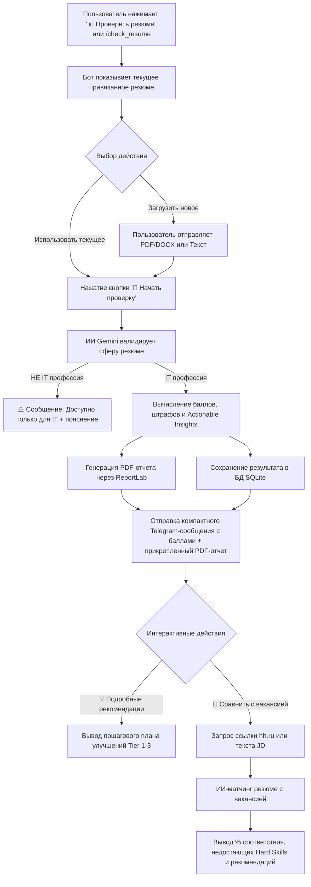

# 📊 Спецификация функции «Проверка IT-резюме» (Resume Audit & Scoring)

Настоящий документ содержит подробное описание функционала проверки и скоринга резюме для Telegram-бота **LeadScout AI**. Функция разработана специально для **IT-специальностей** на основе алгоритмов и математической модели из документа [Спецификация алгоритма скоринга резюме.md](file:///c:/Users/dvd/Desktop/LeadScout_AI/%D0%A1%D0%BF%D0%B5%D1%86%D0%B8%D1%84%D0%B8%D0%BA%D0%B0%D1%86%D0%B8%D1%8F%20%D0%B0%D0%BB%D0%B3%D0%BE%D1%80%D0%B8%D1%82%D0%BC%D0%B0%20%D1%81%D0%BA%D0%BE%D1%80%D0%B8%D0%BD%D0%B3%D0%B0%20%D1%80%D0%B5%D0%B7%D1%8E%D0%BC%D0%B5.md).

---

## 🚀 1. Обзор функции и ключевые цели

* **Название функции:** Проверка и аудит IT-резюме (Resume Score & Audit).
* **Целевая аудитория:** IT-специалисты всех уровней (Junior, Middle, Senior, Lead) по направлениям: Backend, Frontend, Fullstack, Mobile, DevOps, QA, Data Science / ML, Product & Project Management.
* **Главное ограничение:** Функция доступна **строго для IT-профессий**. При попытке проверить резюме из других сфер (например, бухгалтер, юрист, продавец) ИИ автоматически определяет нерелевантность и выдает вежливый отказ с пояснением.
* **Основные ценности для пользователя:**
  1. **Экспресс-оценка 0–100 баллов** по 5 профессиональным категориям.
  2. **Детекция барьеров ATS** (скрытый текст, сложная верстка, переспам ключевиками, отсутствие контактов).
  3. **Оценка результативности (Impact)** по фреймворку Google XYZ / STAR.
  4. **Генерация полноценного PDF-отчета** с графическим оформлением для скачивания.
  5. **Двухэтапный матчинг под конкретную вакансию** (сравнение по ссылке с hh.ru или тексту JD).

---

## 🗺️ 2. Пользовательский путь (User Journey / User Flow)



### Подробное описание шагов:

#### Шаг 1. Вход в режим проверки
* Пользователь нажимает кнопку клавиатуры `📊 Проверить резюме (IT)` или вводит команду `/check_resume`.
* Бот проверяет наличие привязанного резюме в активном аккаунте hh.ru или локально сохраненного текста/PDF.

#### Шаг 2. Подтверждение или смена резюме
* Бот выводит карточку текущего резюме:
  * Название резюме / Должность.
  * Длина текста резюме.
  * Способ загрузки (сохранено с hh.ru / PDF / текст).
* **Inline-кнопки:**
  * `🚀 Начать экспресс-проверку`
  * `📤 Загрузить другой PDF / Текст`

#### Шаг 3. ИИ-анализ и Валидация на IT-профессию
* При нажатии `🚀 Начать экспресс-проверку` бот отправляет статусное сообщение: `🔍 ИИ анализирует резюме по стандартам ATS и макросам Google XYZ...`.
* Запрос передается в **Google Gemini** со структурированной JSON-схемой (Pydantic).
* **Валидация IT-сферы:**
  * Если `is_it_profession == False`: Бот редактирует сообщение:
    > ⚠️ **Проверка доступна только для IT-резюме!**
    > 
    > Ваше резюме распознано как: **[Название сферы, например: Главный бухгалтер]**.
    > Модуль автоскоринга настроен на аналитику IT-профессий (Software Engineering, Data, DevOps, QA, Product).
    > 
    > *Если произошла ошибка, попробуйте обновить текст или загрузить IT-резюме.*
  * Если `is_it_profession == True`: Переход к расчёту баллов.

#### Шаг 4. Расчёт результатов и генерация отчета
* На основе данных Gemini рассчитывается итоговый балл (0–100) с учетом штрафов.
* Формируется красивый PDF-документ `LeadScout_Resume_Audit.pdf` с использованием библиотеки **ReportLab**.
* Результат сохраняется в таблицу БД SQLite `resume_audits`.

#### Шаг 5. Вывод отчета в Telegram
* Бот отправляет сообщение в Telegram с визуальным прогресс-баром и бэджами оценок.
* К сообщению прикрепляется файл `LeadScout_Resume_Audit.pdf`.
* **Inline-кнопки сообщения:**
  * `💡 Подробные рекомендации (Tier 1-3)`
  * `🎯 Сравнить с вакансией (hh.ru / JD)`
  * `🔄 Проверить снова`

#### Шаг 6. Сравнение с конкретной вакансией (Опциональный 2-й этап)
* При нажатии `🎯 Сравнить с вакансией`:
  * Бот просит: `Пришлите ссылку на вакансию с hh.ru или вставьте текст описания вакансии (Job Description).`
  * Пользователь отправляет ссылку или текст.
  * Бот скачивает/парсит описание вакансии и запускает **Job Match Engine** через Gemini.
  * Бот выводит результат: **Соответствие вакансии (Match Score %)**, список совпавших и отсутствующих ключевых навыков (Hard Skills Gap), и советы по адаптации резюме под данную роль.

---

## 🧮 3. Математическая модель и категории скоринга

Общий балл резюме рассчитывается по формуле из спецификации:
$$S_{\text{final}} = \text{CLIP}_{[0, 100]} \left( \sum_{k=1}^{5} (W_k \cdot S_k) - P_{\text{penalty}} \right)$$

### 📊 Весовые категории ($W_k$) и Калибровка по коммерческим ATS (HireHi, Jobscan, CV-Scanner)

#### 🎯 Калибровочные ориентиры баллов:
* **90–100 (Идеальное резюме, Топ-2%)**: $>50\%$ буллетов содержат жесткие цифры (%, $, RPS, мс, число юзеров), полное отсутствие глаголов процесса («занимался», «участвовал»), идеальный стек, подтвержденный в проектах, контакты, стаж 2–4 года.
* **75–89 (Хорошее резюме)**: Сильный стек, есть результаты в цифрах, но не во всех ролях.
* **55–74 (Среднее резюме большинства разработчиков)**: Описание опыта через процессы («Разрабатывал микросервисы», «Настраивал CI/CD»), отсутствие конкретных бизнесовых метрик.
* **< 55 (Слабое резюме / Барьеры ATS)**: Частая смена работы ($<1$ года), пассивный залог, пропуски контактов или пропуски в стаже $>6$ мес.

| № | Категория | Вес ($W_k$) | Что оценивается |

|---|---|---|---|
| 1 | **Hard Skills & Domain Matching** | **30%** | Покрытие стека технологий, прямые и косвенные синонимы (ESCO/O*NET), упоминание навыков в контексте работы, а не простым списком. |
| 2 | **Результативность & Impact (XYZ/STAR)** | **25%** | Доля пунктов работы с метриками ($\ge 40\%$), наличие сильных глаголов действия (*Engineered, Scaled, Spearheaded*), соответствие формуле Google XYZ. |
| 3 | **Техническая читаемость & ATS Format** | **15%** | Распознаваемость текста (вектор vs OCR), стандартность заголовков секций, полнота контактных данных. |
| 4 | **Хронология & Карьерный трек** | **15%** | Логика роста должностей, средний стаж на одном месте (2–4 года = топ, $<1$ года = job-hopping), отсутствие необъясненных пауз $>6$ мес. |
| 5 | **Стиль, лаконичность & Soft Skills** | **15%** | Оптимальный объем (500–1200 слов), подкрепление Soft Skills реальными кейсами в опыте, отсутствие пассивного залога и ошибок. |

### ⚠️ Система штрафов ($P_{\text{penalty}}$)

* **Сложная верстка / Таблицы:** $>20\%$ текста во вложенных графических таблицах $\to$ **$-15...20$ баллов**.
* **Пропуски в стаже:** Необъясненные паузы между ролями $>6$ месяцев $\to$ **$-5...15$ баллов**.
* **Keyword Stuffing (Переспам ключевиками):** Частота токена $>8\%$ от всего объема слов $\to$ **$-20$ баллов**.
* **Невидимый / Скрытый текст:** Белый шрифт, нулевой размер шрифта $\to$ **$-30$ баллов**.
* **Отсутствие контактов:** Нет Email ($-15$ баллов), нет Телефона ($-10$ баллов).
* **Форматные артефакты:** Битые Unicode-символы списка, проблемы кодировки $\to$ **$-5...10$ баллов**.

---

## 📱 4. UI / UX макеты сообщений в Telegram

### 4.1. Стартовый экран проверки резюме
```text
📊 **Проверка и аудит IT-резюме**

👤 **Текущее резюме:** Senior Python Developer
📄 **Источник:** Загружено с hh.ru (или PDF)
📊 **Объем текста:** 4 850 симво символов

Нажмите «🚀 Начать экспресс-проверку» для запуска ИИ-аудита по стандартам ATS и Google XYZ.

[ 🚀 Начать экспресс-проверку ]
[ 📤 Загрузить другой PDF / Текст ]
[ 🔙 Назад в меню ]
```

### 4.2. Результат экспресс-проверки (Telegram-пост)
```text
🏆 **Результат проверки IT-резюме**
📌 **Роль:** Senior Python / Backend Developer
📊 **Итоговый балл:** 78 / 100 [🟩🟩🟩🟩🟩🟩🟩🟧⬜⬜]

---
🟢 **Hard Skills & Стек:** 85/100
🟢 **Impact & Метрики (XYZ):** 72/100
🟢 **Читаемость ATS & Формат:** 90/100
🟡 **Карьерный трек & Стаж:** 68/100
🟢 **Стиль & Оформление:** 75/100

---
⚠️ **Выявленные риски:**
• Пропуск в стаже 8 месяцев (2023 г.) без указания причины (-5 б.)
• Лишь 28% пунктов опыта содержат оцифрованные результаты (цель ≥40%)

💡 **Топ-3 рекомендации:**
1. Оцифруйте результаты работы (добавьте метрики %, $, время).
2. Замените слабые глаголы («Участвовал в...») на сильные («Спроектировал...»).
3. Укажите причину перерыва в опыте в 2023 году.

📎 *Подробный PDF-отчет прикреплен ниже.*

[ 💡 Подробные рекомендации (Tier 1-3) ]
[ 🎯 Сравнить с вакансией (hh.ru / JD) ]
[ 🔄 Проверить снова ]
```

### 4.3. Результат сравнения с вакансией (Job Match)
```text
🎯 **Результат соответствия вакансии**
💼 **Вакансия:** Python Team Lead (СберТех)
📊 **Match Score:** 82% [🟩🟩🟩🟩🟩🟩🟩🟩⬜⬜]
✅ **Статус:** Высокое соответствие роли!

---
✅ **Совпавший стек (Hard Skills):**
Python, Django, FastAPI, PostgreSQL, Docker, Redis, Kubernetes, Git, CI/CD.

⚠️ **Нехватающие ключевые навыки:**
• Apache Kafka (Упомянут RabbitMQ, рекомендуется добавить опыт работы с Kafka)
• ClickHouse (Приветствуется опыт с OLAP БД)

💡 **Совет по отклику:**
Подчеркните ваш опыт архитектурного проектирования микросервисов и руководства командой из 4 разработчиков.

[ ✍️ Сгенерировать ИИ-отклик под вакансию ]
[ 🔙 Назад к аудиту ]
```

---

## 📄 5. Структура PDF-отчета (`LeadScout_Resume_Audit.pdf`)

Отчет генерируется на лету через модуль `ReportLab` и содержит следующие страницы/секции:

1. **Шапка документа (Header):**
   * Логотип LeadScout AI, дата проверки, имя соискателя/название резюме.
   * Крупный цветовой бэдж с итоговым баллом (например, **78/100**).
2. **Диаграмма / Таблица 5 категорий:**
   * Прогресс-бары и текстовая оценка по каждой из 5 категорий.
3. **Анализ ATS-совместимости и штрафы:**
   * Статус парсинга текста, отсутствие скрытого текста, валидация контактов.
   * Детальное описание примененных штрафных вычетов.
4. **Анализ результативности (Google XYZ / STAR):**
   * Примеры слабых пунктов из резюме пользователя.
   * Готовые варианты переформулирования в формате XYZ (*"Разрабатывал сервисы" $\to$ "Спроектировал 4 микросервиса на Go, снизив latency на 35%"*).
5. **Матрица пошаговых действий (Actionable Insights Plan):**
   * **Tier 1 (Blockers):** Срочные исправления (Контакты, Hard Skills, Аномалии).
   * **Tier 2 (Content Optimization):** Внедрение метрик, сильные глаголы.
   * **Tier 3 (Polish & Style):** Форматирование, объемы абзацев, пассивный залог.

---

## 🛠️ 6. Техническая архитектура и БД

### 6.1. Модульная структура проекта
```text
LeadScout_AI/
├── ai_handler.py             # Интеграция с Gemini (ResumeAuditResult, VacancyMatchResult)
├── database.py               # SQLite (init_db, save_resume_audit, get_user_audits)
├── handlers.py               # Aiogram роутер (cmd_check_resume, FSM-состояния)
├── keyboards.py              # Inline-клавиатуры для аудита и матчинга
├── utils/
│   └── pdf_generator.py      # [NEW] Генератор PDF-отчетов через ReportLab
└── Спецификация алгоритма скоринга резюме.md
```

### 6.2. База данных SQLite (`database.py`)

Новая таблица `resume_audits`:
```sql
CREATE TABLE IF NOT EXISTS resume_audits (
    id INTEGER PRIMARY KEY AUTOINCREMENT,
    user_id INTEGER NOT NULL,
    account_id INTEGER,
    profession_name TEXT,
    overall_score INTEGER NOT NULL,
    category_scores_json TEXT NOT NULL,
    penalties_json TEXT,
    insights_json TEXT,
    created_at TIMESTAMP DEFAULT CURRENT_TIMESTAMP,
    FOREIGN KEY (user_id) REFERENCES users (user_id)
);
```

---

## 🔄 7. План поэтапной реализации

1. **Этап 1: Схема БД и Pydantic-модели Gemini** (`database.py`, `ai_handler.py`).
2. **Этап 2: Генератор PDF-отчетов ReportLab** (`utils/pdf_generator.py`).
3. **Этап 3: Клавиатуры и FSM-состояния** (`keyboards.py`, `handlers.py`).
4. **Этап 4: Хэндлеры экспресс-аудита и валидация IT** (`handlers.py`).
5. **Этап 5: Хэндлеры матчинга под вакансию** (`handlers.py`).
6. **Этап 6: Ручное тестирование и верификация**.
