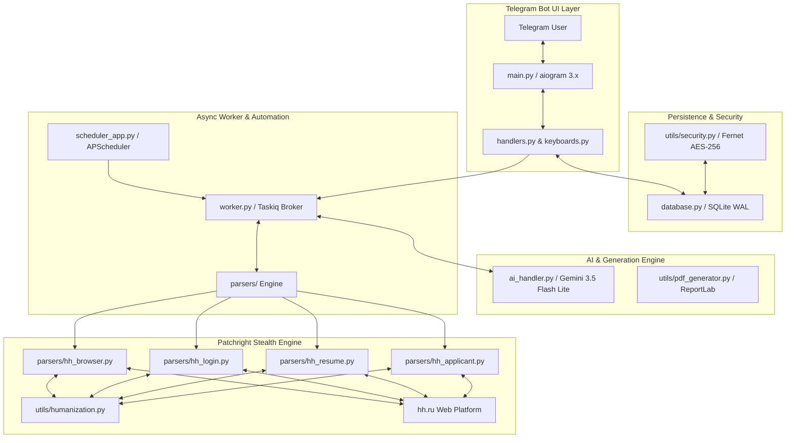

# 🤖 LeadScout AI — Архитектура и Подробное Описание Всех Модулей Проекта

**LeadScout AI** — это автономная SaaS-платформа в формате Telegram-бота для автоматизации поиска работы и отправки персонализированных откликов на вакансии **hh.ru** с помощью искусственного интеллекта **Google Gemini 3.5 Flash Lite**, анонимного браузерного антидетекта **Patchright Stealth** и асинхронной архитектуры на Python (`aiogram 3.x`, `aiosqlite`, `taskiq`, `apscheduler`).

---

## 📐 1. Полная Архитектура Системы

---

## 🗂 2. Детальный Разбор Абсолютно Каждого Модуля Проекта

Ниже приводятся исчерпывающие описания назначения, структуры и функций каждого из 16 исходных файлов проекта.

---

### 📄 1. `config.py` — Конфигурация и Константы Проекта
* **Назначение**: Загружает переменные окружения из файла `.env` с помощью `python-dotenv` и объявляет глобальные системные константы, параметры по умолчанию для hh.ru, промты ИИ и пути к локальным хранилищам.
* **Ключевые переменные и параметры**:
  - `BOT_TOKEN`: Токен доступа Telegram-бота.
  - `ADMIN_IDS`: Список Telegram ID администраторов.
  - `GEMINI_API_KEY`: API-ключ Google GenAI.
  - `GEMINI_MODEL`: Модель ИИ (по умолчанию: `gemini-3.5-flash-lite`).
  - `REDIS_URL`: URL брокера Redis (по умолчанию: `redis://localhost:6379/0`).
  - `SESSION_ENCRYPTION_KEY`: Ключ AES-256 Fernet для шифрования сессий hh.ru.
  - `DEFAULT_DAILY_LIMIT` (50), `DEFAULT_MIN_DELAY_SEC` (30), `DEFAULT_MAX_DELAY_SEC` (180): Дефолтные параметры интервалов и лимитов откликов.
  - `MAX_CONCURRENT_BROWSERS` (2): Лимит параллельных браузеров на 1 IP-адрес.
  - `DB_PATH`: Абсолютный путь к базе SQLite (`leadscout.db`).
  - `HH_COVER_LETTER_SYSTEM_PROMPT`: Системный промт с правилами живого человеческого стиля написания сопроводительных писем без ИИ-штампов.

---

### 📄 2. `database.py` — Асинхронный Слой Базы Данных SQLite
* **Назначение**: Обеспечивает асинхронное взаимодействие с СУБД SQLite через библиотеку `aiosqlite`. Поддерживает мульти-аккаунтность, зашифрованные куки, логирование откликов, анкет и ИИ-аудитов резюме.
* **Таблицы базы данных**:
  1. `users`: Профили пользователей Telegram (SaaS-аккаунты), глобальные настройки, ссылка на активный аккаунт hh.ru (`active_account_id`).
  2. `hh_accounts`: Мульти-аккаунты hh.ru для каждого соискателя (телефон/email, название, зашифрованные куки `encrypted_storage_state`, статус сессии, ключевые слова, стоп-слова, минимальная ЗП, флаги автоотклика).
  3. `hh_vacancies`: Кэш найденных вакансий hh.ru (название, компания, зарплата, URL, описание, JSON вопросов).
  4. `hh_applies`: История отправленных откликов с привязкой к `user_id` и `account_id` (текст письма, статус, дата).
  5. `resume_audits`: Результаты ИИ-аудита резюме (оценки по 5 категориям, итоговый балл, штрафы, топ-советы, матрица insights в формате JSON).
  6. `pending_questionnaires`: Отложенные анкеты работодателей, требующие подтверждения пользователя из Telegram.
  7. `orders` & `subscribers`: Таблицы поддержки фриланс-источников.
* **Основополагающие функции**:
  - `init_db()`: Создает таблицы, индексы (`idx_hh_applies_acc_vac`, `idx_hh_accounts_user`) и настраивает режимы производительности (`PRAGMA journal_mode=WAL; PRAGMA busy_timeout=10000;`).
  - `get_or_create_user(user_id)`: Получение или инициализация пользователя.
  - `get_user_accounts(user_id)`, `get_active_account(user_id)`, `set_active_account(user_id, account_id)`: Управление мульти-аккаунтами.
  - `create_hh_account()`, `delete_hh_account()`: Создание и удаление аккаунтов соискателя.
  - `update_account_session()`, `update_account_settings()`: Обновление куки-сессий и параметров поиска.
  - `is_account_already_applied()`, `save_account_hh_apply()`: Дедупликация и фиксация откликов.
  - `save_resume_audit()`, `get_user_latest_audit()`: Сохранение и извлечение результатов аудита резюме.

---

### 📄 3. `main.py` — Точка Входа и Инициализация Telegram-Бота
* **Назначение**: Главный исполняемый модуль приложения. Инициализирует базы данных, выставляет UTF-8 кодирование для Windows-консоли, запускает диспетчер `aiogram 3.x`, роутеры обработчиков и плановый планировщик задач.
* **Основные этапы работы**:
  1. Выполняет `sys.stdout.reconfigure(encoding='utf-8')` для корректного вывода эмодзи в консоль Windows.
  2. Запускает `init_db()` для миграции структуры SQLite.
  3. Инициализирует объекты `Bot` и `Dispatcher` с хранилищем состояний `MemoryStorage`.
  4. Подключает роутер `bot_router` из `handlers.py`.
  5. Стартует планировщик `start_scheduler()`.
  6. Входит в неблокирующий цикл Long Polling (`dp.start_polling(bot)`) с автоперезапуском при временных сетевых сбоях Telegram API.

---

### 📄 4. `handlers.py` — Обработчики Команд и FSM Диалогов Telegram
* **Назначение**: Содержит всю логику взаимодействия с пользователем Telegram (обработка команд `/start`, `/help`, `/check_resume`, нажатий текстовых и инлайн-кнопок, FSM-состояний ввода СМС-кодов, капчи, поиска и настроек).
* **Ключевые FSM-состояния (`Form`)**:
  - `waiting_for_phone_or_email`: Ожидание ввода логина hh.ru.
  - `waiting_for_otp`: Ожидание 4-6 значного СМС-кода.
  - `waiting_for_captcha`: Ожидание ввода текста с картинки капчи.
  - `waiting_for_pdf_resume`: Ожидание загрузки PDF-файла резюме.
  - `waiting_for_keywords`, `waiting_for_stop_words`, `waiting_for_salary`, `waiting_for_limit`, `waiting_for_proxy`: Ожидание ввода соответствующих настроек.
  - `waiting_for_custom_audit_pdf`, `waiting_for_custom_audit_text`: Ожидание материалов для ИИ-аудита.
  - `waiting_for_vacancy_for_matching`: Ожидание ссылки или текста вакансии для ИИ-сравнения.
* **Главные обработчики**:
  - `cmd_start()`, `cmd_help()`: Вывод главного меню и справки.
  - `process_action_toggle()`: Запуск/остановка автоотклика для активного или всех аккаунтов.
  - `process_account_selection()`, `process_add_new_account()`: Переключение и добавление мульти-аккаунтов.
  - `process_otp_code()`, `process_captcha_code()`: Передача введенных кодов в менеджер авторизации `HHLoginManager`.
  - `process_document_resume()`: Прием PDF-резюме, извлечение текста через `pypdf`, выгрузка на hh.ru через `HHResumeManager`.
  - `process_resume_check_cmd()`, `process_start_resume_audit()`: Запуск 5-факторного ИИ-аудита резюме.
  - `process_vacancy_matching_text()`: Сравнение резюме с вакансией работодателя.

---

### 📄 5. `keyboards.py` — Генератор Интерактивных Клавиатур
* **Назначение**: Содержит вспомогательные функции для сборки Reply (текстовых) и Inline (встроенных) клавиатур Telegram (`aiogram.types`).
* **Основные функции сборки меню**:
  - `get_main_keyboard(is_auto_apply_running)`: Главная клавиатура из 4 кнопок.
  - `get_accounts_resume_hub_keyboard()` & `get_settings_analytics_hub_keyboard()`: Главные хабы управления.
  - `get_accounts_inline_keyboard()`: Меню выбора активного мульти-аккаунта с индикаторами статуса (`🟢`, `⭐`, `🚀`).
  - `get_settings_inline_keyboard()`: Настройки активного аккаунта (ЗП, лимиты, прокси, удаленка, письма).
  - `get_captcha_inline_keyboard()`: Управление капчей (`🔄 Обновить картинку`, `🌐 English/Русский`).
  - `get_resume_inline_keyboard()` & `get_resume_action_keyboard()`: Управление списком резюме с hh.ru.
  - `get_questionnaire_confirmation_keyboard()`: Подтверждение отправки сложной анкеты.
  - `get_resume_audit_result_keyboard()`: Клавиатура результатов ИИ-оценки резюме.

---

### 📄 6. `ai_handler.py` — ИИ-Модуль на Базе Google GenAI (`gemini-3.5-flash-lite`)
* **Назначение**: Отвечает за интеллектуальный анализ резюме, генерацию персонализированных сопроводительных писем, заполнение анкет работодателей, извлечение ключевых слов и проведение ATS-аудита на базе модели `gemini-3.5-flash-lite` с использованием Pydantic Structured Outputs (`response_schema`).
* **Модели Pydantic (Схемы ответов ИИ)**:
  - `JobApplicationPayload`: Результат оценки релевантности вакансии, сопроводительное письмо (40-70 слов), ответы на вопросы анкеты (`answers`), флаг автоотправки и балл уверенности.
  - `SearchKeywordsPayload`: Список из 3-6 ключевых слов для поиска вакансий под данное резюме.
  - `ResumeAuditPayload` & `CategoryScores` & `ActionableInsight`: Данные 5-факторного ATS-аудита резюме (балл 0-100, штрафы, рекомендаций по Tier 1-3).
  - `VacancyMatchPayload`: Процент соответствия резюме требованиям вакансии, совпавшие/отсутствующие навыки, рекомендации.
  - `FullStructuredResume`: Структура резюме для пошагового автозаполнения формы hh.ru.
* **Главные асинхронные функции (с оберткой `asyncio.to_thread`)**:
  - `generate_hh_job_application()`: Анализ вакансии и генерация письма/анкеты.
  - `extract_search_keywords_from_resume()`: ИИ-извлечение поисковых ключей из резюме.
  - `analyze_resume_quality()`: Строгий ATS-аудит резюме по 5 категориям.
  - `match_resume_to_vacancy()`: Матчинг резюме с текстом вакансии.
  - `extract_full_structured_resume()`: Извлечение структуры из текста PDF.

---

### 📄 7. `worker.py` — Асинхронный Фоновый Воркер Taskiq
* **Назначение**: Выполняет тяжелые фоновые процессы автоматизации браузера: поиск вакансий на hh.ru, отправку откликов для каждого аккаунта и физическую отправку подтвержденных анкет из Telegram.
* **Архитектурные особенности**:
  - **Динамический брокер**: Автоматически выбирает `ListQueueBroker` (Redis), а при отсутствии Redis включает встроенный `InMemoryBroker`.
  - **Семафор рассинхронизации**: `asyncio.Semaphore(MAX_CONCURRENT_BROWSERS)` ограничивает одновременный запуск браузеров (до 2 штук) со случайной задержкой 5-15 секунд для предотвращения банов по IP.
* **Главные задачи (`@broker.task`)**:
  - `process_account_hh_applications(account_id)`: Цикл поиска и откликнуться на вакансии для конкретного аккаунта hh.ru.
  - `process_user_hh_applications(user_id)`: Запуск задач автоотклика для всех активных аккаунтов соискателя.
  - `submit_approved_hh_questionnaire(user_id, apply_id)`: Отправка подтвержденной анкеты через открытый браузер.

---

### 📄 8. `scheduler_app.py` — Легкий Планировщик Задач (APScheduler)
* **Назначение**: Запускает периодические фоновые задачи по расписанию без блокировки основного Event Loop.
* **Запланированные задачи (Jobs)**:
  1. `hh_auto_search` (интервал: каждые 45 минут): Вызывает `trigger_all_users_search()`, собирает все аккаунты со статусом `session_status = 'ACTIVE'` и включенным `auto_apply_enabled = 1` и отправляет задачи поиска в воркер Taskiq.
  2. `daily_reset` (cron: каждые сутки в 00:00): Вызывает `reset_all_account_daily_limits()`, обнуляя счетчики `applied_today` для всех аккаунтов.

---

### 📄 9. `utils/security.py` — Модуль Шифрования Сессий (Fernet AES-256)
* **Назначение**: Обеспечивает безопасное хранение браузерных сессий (куки и LocalStorage) в базе данных SQLite.
* **Класс `SessionSecurityManager`**:
  - Автоматически формирует 32-байтовый ключ шифрования `Fernet` с использованием `hashlib.sha256` на основе `SESSION_ENCRYPTION_KEY`.
  - `encrypt_storage_state(state_dict)`: Зашифровывает словарь `storage_state` (JSON) в бинарный BLOB.
  - `decrypt_storage_state(encrypted_data)`: Расшифровывает BLOB обратно в словарь `storage_state`.

---

### 📄 10. `utils/humanization.py` — Модуль Симуляции Человеческого Поведения (Humanization Engine)
* **Назначение**: Эмулирует реальные действия физического пользователя в браузерном контексте Patchright для обхода антибот-систем hh.ru и Variti.
* **Основные алгоритмы и функции**:
  - `generate_bezier_curve(start_x, start_y, end_x, end_y)`: Генерирует физическую траекторию движения мыши по кубическим кривым Безье с синусоидальным замедлением $t' = \sin(t \cdot \pi / 2)$ у целевой кнопки.
  - `human_click(page, locator)`: Плавный проход мыши по кривой Безье с микропаузой и кликом в случайной точке внутри элемента.
  - `human_type(page, locator, text)`: Заполнение текстовых полей с гарантированной поддержкой кириллицы.
  - `human_type_digits(page, locator, code)`: Посимвольный ввод СМС/OTP кодов с индивидуальными паузами (120-250 мс).
  - `human_scroll(page, steps)`: Естественный скроллинг страницы колесом мыши.

---

### 📄 11. `utils/pdf_generator.py` — Генератор PDF-Отчетов Аудита Резюме (ReportLab)
* **Назначение**: Создает графические PDF-документы формата A4 с результатами ИИ-аудита резюме.
* **Особенности реализации**:
  - Динамическая регистрация кириллических шрифтов (`ArialCyr` / `DejaVuSans`).
  - Формирование стилизованных карточек общего балла (зеленый/желтый/красный бейджи).
  - Генерация визуальных прогресс-баров (`█░`) для 5 категорий оценок.
  - Оформление списка штрафов ATS и пошаговой матрицы рекомендаций Actionable Insights (Tier 1-3).

---

### 📄 12. `parsers/hh_browser.py` — Модуль Браузерного Движка (Patchright Stealth Engine)
* **Назначение**: Управляет запуском анонимизированного Chromium-браузера на базе **Patchright**, настройкой сетевого контекста и оптимизацией трафика.
* **Класс `HHBrowserEngine`**:
  - `start()`: Запускает Chromium с флагами отмены автоматизации (`--disable-blink-features=AutomationControlled`, `--no-sandbox`, `--disable-dev-shm-usage`). Поддерживает прокси.
  - `create_context(storage_state)`: Создает изолированный `BrowserContext` с русскоязычной локалью, московским часовым поясом (`Europe/Moscow`) и установленным `storage_state`.
  - `intercept_network_traffic(route)`: Блокирует загрузку тяжелых медиа, картинок, шрифтов и счетчиков (Яндекс.Метрика, Google Analytics, Mail.ru), сохраняя загрузку капчи для ускорения работы и экономии RAM.

---

### 📄 13. `parsers/hh_login.py` — Модуль Интерактивной 2FA Авторизации hh.ru
* **Назначение**: Управляет процессами входа соискателя на hh.ru по номеру телефона или Email с поддержкой ввода СМС-кодов и картинки капчи прямо в Telegram.
* **Классы**:
  - `HHLoginSession`: Состояние отдельной сессии входа. Выполняет переход на `hh.ru/account/login`, ввод номера/Email, перехват картинки капчи (при появлении), посимвольный ввод OTP-кода и сохранение зашифрованных куки в БД.
  - `HHLoginManager`: Глобальный реестр активных сессий входа. Автоматически очищает заброшенные сессии авторизации по таймауту через 10 минут (`_auto_cleanup_session`).

---

### 📄 14. `parsers/hh_resume.py` — Модуль Взаимодействия с Резюме на hh.ru
* **Назначение**: Отвечает за получение списка существующих резюме пользователя с hh.ru, извлечение текста из PDF и выгрузку новых резюме на сайт.
* **Класс `HHResumeManager`**:
  - `fetch_user_resumes(user_id)`: Парсит страницу `hh.ru/applicant/resumes`, находит карточки резюме, извлекает их 32-значные хэш-ID и заголовки.
  - `upload_pdf_resume_to_hh(user_id, pdf_path)`: Переходит в формы выгрузки hh.ru, прикрепляет PDF-файл, выжидает распознавание hh.ru и публикует резюме со статусом *"Видно всем работодателям"*.
  - `_fill_step_by_step_resume()`: Резервный ИИ-мастер пошагового автозаполнения полей резюме при отсутствии инпута загрузки файла.
  - `delete_resume_on_hh(user_id, resume_id)`: Автоматически находит и удаляет резюме с сайта hh.ru по его 32-значному ID через клик по иконке корзины и подтверждение в модальном окне.

---

### 📄 15. `parsers/hh_applicant.py` — Модуль Автоматизации Откликов (DOM data-qa Selectors)
* **Назначение**: Исполнительный модуль откликов на вакансии hh.ru.
* **Ключевые сценарии работы (`apply_to_hh_vacancy`)**:
  1. Извлечение информации о вакансии (заголовок, компания, описание).
  2. Проверка стоп-слов в тексте вакансии.
  3. Перехват модального окна *"Отклик на вакансию"*.
  4. Автозаполнение анкеты работодателя (`fill_questionnaire_form`) для полей `text`, `radio`, `checkbox`.
  5. Открытие инпута *"Добавить сопроводительное"* и ввод сгенерированного Gemini письма (или одиночной точки `.`).
  6. Нажатие синей кнопки отклика и проверка подтверждения успеха через `verify_hh_application_success()`.

---

### 📄 16. `parsers/base.py` — Абстрактный Базовый Класс Парсеров
* **Назначение**: Определяет единый абстрактный интерфейс `BaseParser` с асинхронным методом `parse() -> list[dict]` для расширения поддержки других площадок и бирж.

---

## 📊 Таблица Взаимосвязей и Зависимостей Модулей

| Модуль | Зависит от | Исполняет роль / Используется в |
| :--- | :--- | :--- |
| **`config.py`** | `.env` | Чтение параметров всеми модулями проекта |
| **`database.py`** | `config.py`, `aiosqlite` | Хранение пользователей, аккаунтов, откликов и аудитов |
| **`main.py`** | `config.py`, `database.py`, `handlers.py`, `scheduler_app.py` | Точка входа Telegram-бота |
| **`handlers.py`** | `database.py`, `keyboards.py`, `ai_handler.py`, `parsers/*` | UI диалоги и обработка Telegram FSM |
| **`keyboards.py`** | `aiogram` | Построение клавиатур для `handlers.py` |
| **`ai_handler.py`** | `config.py`, `google-genai`, `pydantic` | Интеллектуальный генератор писем, анкет и аудита резюме |
| **`worker.py`** | `config.py`, `database.py`, `ai_handler.py`, `parsers/*` | Асинхронный воркер выполнения откликов |
| **`scheduler_app.py`** | `database.py`, `worker.py`, `apscheduler` | Запуск поиска по расписанию каждые 45 мин |
| **`utils/security.py`**| `cryptography` | Шифрование и расшифровка кук сессий |
| **`utils/humanization.py`** | `patchright` | Эмуляция человеческих движений и ввода текста |
| **`utils/pdf_generator.py`** | `reportlab` | Генерация PDF-отчетов аудита резюме |
| **`parsers/hh_browser.py`** | `config.py`, `patchright` | Управление Chromium контекстами и блокировкой рекламы |
| **`parsers/hh_login.py`** | `hh_browser.py`, `humanization.py`, `security.py` | Интерактивный вход соискателя на hh.ru |
| **`parsers/hh_resume.py`** | `hh_browser.py`, `humanization.py`, `pypdf` | Парсинг, выгрузка и удаление резюме на hh.ru |
| **`parsers/hh_applicant.py`** | `hh_browser.py`, `humanization.py`, `ai_handler.py` | Выполнение откликов на вакансии hh.ru |
| **`parsers/base.py`** | `abc` | Базовый интерфейс парсеров |

