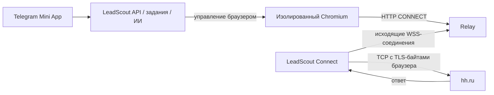

# LeadScout: выход к hh.ru через устройства пользователей

Технический проект, версия 0.1 — 17 сентября 2026 года.

Статус: проект решения для реализации, не готовая реализация и не подтверждение прохождения модерации магазинов. Код продукта и рабочая конфигурация не изменены. Числа таймаутов, квот и размеров очередей ниже — предлагаемые стартовые настройки, а не лимиты hh.ru или гарантии ОС.

## Документы

1. [Этот документ](README.md): решение, ограничения, пользовательские сценарии и экономика.
2. [Протокол и безопасность](PROTOCOL.md): привязка устройств, авторизация, CONNECT, WebSocket, состояния, обрывы и границы доверия.
3. [Четыре платформы](PLATFORMS.md): iOS, Android, Windows, macOS; жизненный цикл, упаковка, настройка и проверки.
4. [Сервер, внедрение и эксплуатация](SERVER-IMPLEMENTATION.md): изменения в LeadScout, схема данных, сеть, развертывание, тесты и этапы разработки.

Термины: «агент» — установленный сетевой помощник пользователя; «relay» — наш сервер, связывающий браузер с агентом; «lease» — короткоживущее разрешение на маршрут для конкретного задания; «epoch» — поколение соединения/сети, исключающее использование старого маршрута.

## 1. Решение

Сохраняем Telegram Mini App как основной интерфейс. Поиск, ИИ, письма, формы, cookies и браузерная автоматизация остаются в серверной части. На устройство устанавливается LeadScout Connect, который открывает исходящее защищённое соединение к нашему relay. Через него браузер просит устройство открыть TCP-соединение с разрешённым сервером hh.ru.



Стрелка от агента к relay показывает инициатора соединения; обмен внутри двунаправленный. Ни IP телефона, ни входящий порт телефона не должны быть доступны серверу. Проброс портов, публичный IPv4 и настройка домашнего роутера не требуются. CGNAT не мешает исходящему соединению.

hh.ru увидит внешний адрес сети выбранного устройства: Wi-Fi, мобильного оператора или пользовательского VPN. Это не обязательно уникальный, постоянный или принадлежащий только одному человеку IP. Для пользователя iPhone, выбравшего Mac как выход, это будет сеть Mac.

TLS к hh.ru завершается в серверном Chromium и на hh.ru. Агент передаёт зашифрованные байты и не получает cookies или пароль hh.ru. При этом наш сервер по-прежнему обладает сессией пользователя; эта архитектура не переносит хранение сессии с сервера.

## 2. Что можно обещать по платформам

| Платформа выхода | Предлагаемый режим | Работа после ухода из Telegram | Ограничение |
|---|---|---|---|
| Windows 11 | Tray-приложение в пользовательской сессии | Да, пока компьютер бодрствует и агент запущен | Сон, выход из Windows и выключение прерывают связь |
| macOS 13+ | Menu bar-приложение + запуск при входе | Да, пока Mac бодрствует и агент запущен | Закрытие крышки/сон/выход из сессии прерывают связь |
| Android 10+ | Запущенный пользователем конечный сеанс с foreground service | Кандидат для фоновой работы с уведомлением | Квоты ОС, энергосбережение, OEM; проверка на реальных устройствах |
| iOS 26+ | Конечная задача пользователя через BGContinuedProcessingTask | Кандидат для продолжения после сворачивания агента | Обязательный аппаратный эксперимент; нет обещания непрерывной доступности |
| iOS до 26 | Агент на переднем плане | Не рассчитываем на фон | Для фоновой работы выбирается другое собственное устройство |

Версии — предлагаемая продуктовая матрица, не утверждение о текущих требованиях магазинов. Перед публикацией проверяются актуальные target SDK/Xcode и поддерживаемые версии ОС.

Apple допускает продолжение запущенной пользователем конечной работы в iOS 26; возможность использовать этот механизм именно для нашего сетевого помощника должна быть подтверждена экспериментом и проверкой распространения. [Apple, BGContinuedProcessingTaskRequest](https://developer.apple.com/documentation/backgroundtasks/bgcontinuedprocessingtaskrequest).

У обычного iOS-приложения нет общего механизма постоянной фоновой работы или запуска по расписанию с гарантированным интервалом. Поэтому одинаковая круглосуточная доступность четырёх платформ не является требованием, которое эта схема может выполнить. [Apple DTS: ограничения фоновой работы](https://developer.apple.com/forums/thread/685525).

## 3. Продуктовые инварианты

1. Устройство используется только для аккаунтов его владельца в LeadScout. Общего пула пользовательских IP нет.
2. Пользователь видит, какое устройство обслуживает аккаунт, и может остановить связь локально и в Mini App.
3. Для `DEVICE_REQUIRED` отсутствие устройства означает ожидание. Автоматического выхода через сервер или чужое устройство нет.
4. Вход, OTP, капча, поиск, отклики, анкеты, синхронизация и публикация резюме используют один выбранный маршрут.
5. Статус `READY` означает работоспособный маршрут и доступный режим исполнения, а не только наличие WebSocket.
6. Контекст hh.ru и внешняя изменяющая операция не перескакивают между устройствами.
7. Потеря подтверждения отправки не вызывает автоматическую повторную отправку.
8. Функции без обращения к hh.ru доступны без агента: настройки, история, локальные черновики, ИИ-анализ уже загруженных данных.
9. Нет обещания отсутствия банов: удалённый Chromium остаётся удалённым Chromium. Смена IP не меняет правила hh.ru и не превращает отпечаток Linux-браузера в Safari на iPhone.
10. «Все функции сохранены» означает наличие прежних операций при доступном маршруте. Доступность по расписанию при спящем устройстве сохранить нельзя.

## 4. Пользовательский путь

### Первое подключение

1. Mini App → «Подключение» → «Добавить устройство».
2. Выбор платформы и установка подписанного LeadScout Connect с официальной страницы.
3. Агент создаёт собственный ключ устройства, получает короткий код привязки.
4. Пользователь вводит код в Mini App или сканирует QR с другого экрана. На одном телефоне работает ссылка в Telegram; ручной код остаётся резервом.
5. Mini App показывает имя/платформу устройства, пользователь подтверждает привязку. Агент показывает владельца и просит подтвердить подключение с его стороны.
6. Агент получает только права сетевого помощника; не получает сессию Mini App, Telegram bot token или cookies hh.ru.
7. Настройка Wi-Fi/мобильного трафика, лимита данных, времени сеанса и разрешённых аккаунтов.
8. Проверка маршрута на нашем диагностическом HTTPS-сервисе. Затем статус «Подключено».
9. Назначение устройства аккаунту hh.ru. Для нового аккаунта назначение предшествует первому запросу к странице входа.

### Обычная работа на компьютере

Пользователь запускает агент один раз и по желанию включает автозапуск. Далее работает в Telegram на любом своём устройстве. Пока агент онлайн, сервер выполняет разрешённые задания. После сна задачи ждут восстановления; выключенный компьютер не может быть сетевым выходом.

### Конечный сеанс на телефоне

1. Пользователь выбирает в Mini App аккаунт и объём работы.
2. Сервер создаёт ограниченный план сеанса: владелец, аккаунт, максимальное число заданий, срок, типы операций; план не даёт бессрочное разрешение на новые задания.
3. Mini App открывает агент. Пользователь нажимает в агенте «Начать сеанс».
4. Агент запрашивает допустимый режим ОС. Только после фактического старта и handshake сервер начинает работу.
5. Пользователь возвращается в Telegram; при доступности фонового режима выполняется именно согласованный сеанс.
6. Окончание, отмена, лимит трафика или остановка ОС закрывают маршрут. Для следующего сеанса телефон может потребовать новое действие пользователя.

Не прятать эту процедуру под обещанием «всегда работает». Для iOS первый релиз может включать только foreground-режим, если проверка фонового режима не пройдена.

### Устройство офлайн

Mini App сообщает: «Ждём подключения вашего Mac» или «Откройте Connect на iPhone и начните сеанс». Очередь не размножается при каждом 45-минутном тике scheduler. Уведомление отправляется при существенном изменении, а не при каждом повторном опросе.

### Смена устройства

Владелец выбирает другое своё устройство. Сервер прекращает выдачу новых операций, завершает/помечает текущую, закрывает старые контексты и соединения, меняет поколение маршрута. Проверяет новый выход и затем создаёт новый контекст с сохранённой сессией. hh.ru может потребовать повторный вход. По умолчанию автоматического выбора любого онлайн-устройства нет.

## 5. Выбранные технические решения

| Область | Решение v1 | Причина |
|---|---|---|
| Соединение устройства | Исходящий WSS через TCP/443 | Проходит обычные NAT; не требует VPN-профиля |
| Управление | Один control WebSocket на устройство | Небольшой трафик, heartbeats, команды |
| Данные | Один data WebSocket на TCP-stream | Простая изоляция и backpressure без собственного multiplexer |
| Вход браузера | Внутренний HTTP CONNECT proxy | Поддерживается Playwright; HTTPS идёт непрозрачно |
| DNS назначения | На устройстве | hh.ru-соединение устанавливает устройство, не relay |
| Шифрование | WSS + вложенный TLS Chromium↔hh.ru | Никакого MITM и установки корневого сертификата |
| Общий код | Rust core + тонкие платформенные оболочки | Один протокол/парсер/ограничители на четырёх ОС |
| Интерфейс агента | Swift (Apple), Kotlin (Android), C#/.NET (Windows) | Нативный lifecycle, key storage и фоновые APIs |
| Backend | Нынешний FastAPI/Python остаётся управляющим | Не переписывать бизнес-операции |
| Relay | Отдельный процесс Rust на том же VPS в пилоте | Изоляция сетевых потоков от бизнес-API |
| Браузеры | Отдельный закрытый runner | Сетевой запрет прямого выхода при сбое прокси |

Это проектный выбор; зависимости фиксируются после проверки совместимости, а не устанавливаются в этом исследовании. Альтернатива Rust — Go для relay и раздельные нативные агенты, но тогда протокол приходится сопровождать в нескольких реализациях. Для команды без Rust сначала оценить стоимость общего core на маленьком прототипе.

## 6. Себестоимость

Отдельных арендованных IP для пользователей не требуется. Не исчезают:

- CPU/RAM серверных браузеров;
- трафик между relay и устройствами;
- токены ИИ;
- подпись/распространение приложений, сборочная инфраструктура;
- поддержка пользователей, ограничения батареи и сетей;
- разработка и обновления четырёх клиентов.

Для одного байта ответа hh.ru устройство сначала получает байт из интернета, затем отправляет его на relay. Для тела запроса направление обратное. Поэтому суммарный RX+TX устройства ориентировочно вдвое больше объёма полезных запросов/ответов, плюс WSS/TLS, DNS, управляющие сообщения и повторы. Это особенно важно на мобильном тарифе.

Пример расчёта, не замер и не предложение провайдера:

```text
100 пользователей × 50 откликов × 30 дней = 150 000 откликов/месяц
Если на отклик вместе с поиском/загрузками приходится 0.5–2 MB:
  полезный объём ≈ 75–300 GB/месяц
  суммарный RX+TX устройств ≈ 150–600 GB/месяц
  среднее устройство ≈ 1.5–6 GB/месяц
```

Heartbeat и idle-трафик считаются отдельно. Входящий/исходящий трафик VPS зависит от тарифа; нельзя автоматически умножать стоимость на два, не прочитав правила тарификации.

```text
себестоимость активного пользователя =
  (VPS + relay traffic + storage + monitoring + distribution
   + support + amortized development) / active_users
  + AI_cost_per_user
```

До расчёта тарифа замерить `bytes_sent/received`, время браузера, пиковую память, долю успешных подключений и минуты поддержки. Экономия на IP может оказаться меньше добавленной стоимости поддержки телефонов.

## 7. Пропускная способность: отдельное ограничение проекта

В коде сейчас `MAX_CONCURRENT_BROWSERS=2`, допустимый конфигурационный диапазон 1–5, паузы после успешных откликов 30–180 секунд. Браузерный контекст удерживается во время этих пауз. Это ограничения текущей реализации, не требования hh.ru.

При среднем ожидании 105 секунд и 5 000 откликов/день получается около 146 context-hours только ожидания. Два слота дают примерно 73 часа, пять — 29 часов без учёта навигации/ИИ. Добавление пользовательских IP не исправляет эту пропускную способность.

Внедрение включает планировщик коротких порций работы: после подтверждённого действия сохранять состояние, освобождать контекст, назначать `next_eligible_at`. Диалог OTP, капча и незавершённая отправка требуют отдельных ограниченных interactive leases. Паузы и лимиты пользователя сохраняются; множество браузеров не является способом обхода ограничений платформы.

## 8. Порядок инвестиций и критерии остановки

1. На своём тестовом устройстве доказать WSS → TCP → HTTPS с правильным внешним IP и без прямого fallback.
2. До дорогой мобильной разработки провести аппаратный iOS 26 эксперимент конечной задачи и Android эксперимент lifecycle.
3. После подтверждения протокола встроить маршрут во все операции LeadScout, затем выпустить desktop-пилот.
4. Затем Android-пилот с ограниченными сеансами.
5. iOS-публикация — только для фактически доказанного режима. Если нужен iPhone-only продукт с гарантированным расписанием при закрытом агенте, этот вариант не проходит требования.

Если коммерческое обязательство звучит как «все четыре платформы, работа 24/7 при закрытом приложении, без дополнительного действия и без внешнего выхода», проект нужно пересмотреть до реализации. Это не решается настройкой WebSocket.

## 9. Что будет считаться готовностью

Рабочий прототип сети ещё не означает готовность продукта. Для релиза должны пройти: полный сценарий hh.ru с выбранным устройством, изоляция пользователей, сетевой запрет прямого выхода, восстановление без повторных откликов, отзыв устройства, проверка каждой заявленной ОС на физическом устройстве, доступный канал установки и измеренная экономика.

Подробные контракты, проверки и зависимости находятся в следующих трёх документах.
