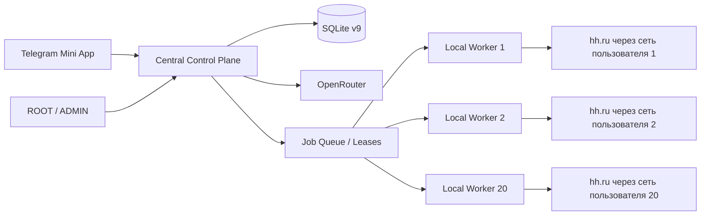

# LeadScout: план тестового запуска без прокси

Дата фиксации: 14 сентября 2026 года  
Статус: план к реализации  
Горизонт пилота: 20 тестировщиков, 30 принадлежащих им аккаунтов hh.ru, 10 дней

## Краткое решение

Полноценный запуск 30 аккаунтов без прокси не должен выполняться через 30 браузерных сессий на одном VPS. Это создаёт единый IP для разных пользователей, единую точку отказа и высокий риск одновременной потери всех сессий.

Целевая схема пилота:

- Telegram Mini App, база, планировщик, администрирование и OpenRouter работают на центральном сервере;
- браузер hh.ru запускается локально на компьютере каждого тестировщика;
- локальный worker устанавливает только исходящие HTTPS-соединения с центральным сервером, поэтому ему не нужны публичный IP, проброс портов, VPN или прокси;
- каждый человек входит в собственные аккаунты hh.ru локально и использует свой обычный домашний или мобильный интернет;
- cookies и browser storage hh.ru не покидают устройство пользователя;
- центральный сервер выдаёт задания, считает лимиты, вызывает ИИ и принимает обезличенные технические результаты;
- на одном устройстве задания выполняются последовательно, даже если у человека два аккаунта;
- после неопределённого результата отправки автоматический повтор запрещён до ручной сверки.

Если локальный worker не реализован, допустим только ограниченный smoke-тест на 1–5 аккаунтах. Полный пилот на 30 аккаунтов с одного серверного IP не входит в рекомендуемый план.

---

## 🎨 Часть 1. Вектор продукта и UX

### 🎯 Цель и сценарии использования

Цель пилота — проверить, способен ли LeadScout стабильно находить подходящие вакансии, готовить корректные отклики и обрабатывать анкеты в течение десяти дней без платных прокси и без массовой эксплуатации одного серверного IP.

Основные участники:

- тестировщик — владелец одного или двух аккаунтов hh.ru;
- ROOT/ADMIN — подключает участников, наблюдает за состоянием и останавливает задания;
- центральный сервер — управляет очередью, лимитами, ИИ и историей;
- локальный worker — выполняет все действия на hh.ru с устройства владельца аккаунта.

Основной сценарий тестировщика:

1. Получить доступ к Mini App через Telegram.
2. Скачать доверенную сборку локального worker.
3. Открыть в Mini App раздел «Подключение компьютера» и получить одноразовый код.
4. Ввести код в worker и увидеть подтверждение привязки устройства.
5. Локально войти в hh.ru, включая OTP или CAPTCHA при необходимости.
6. Выбрать резюме и параметры поиска в Mini App.
7. Включить автоматизацию с дневным лимитом не выше пилотного.
8. Видеть состояние устройства, текущий этап, историю откликов и задания, требующие ручной проверки.
9. В любой момент остановить свой аккаунт; ROOT/ADMIN может выполнить аварийную остановку всего пилота.

### 🖥 Экраны и интерфейс

Существующий Mono-интерфейс сохраняется. Новый UI ограничивается функционально необходимыми состояниями.

#### Настройки → Подключение компьютера

- статус: «Не подключён», «Подключается», «В сети», «Не в сети», «Требует обновления», «Отозван»;
- название устройства и версия worker;
- время последнего heartbeat;
- кнопка «Получить код подключения»;
- кнопка «Отвязать устройство» с подтверждением;
- пояснение: компьютер должен быть включён, а действия hh.ru происходят именно на нём;
- предупреждение, что один аккаунт нельзя одновременно запускать на нескольких устройствах.

#### Карточка аккаунта

- привязанное устройство;
- готовность локальной сессии hh.ru;
- дневные показатели: проверено вакансий, подготовлено, отправлено, требует проверки;
- отдельные лимиты «Проверок в день» и «Откликов в день»;
- доступное окно работы, например 09:00–20:00 МСК;
- причина паузы: worker offline, нужен вход, CAPTCHA, лимит, бюджет ИИ, ручная проверка.

#### Администрирование

- количество online/offline workers;
- версия клиента и наличие устаревших сборок;
- очередь заданий, lease и последний этап выполнения;
- расход OpenRouter за день и весь пилот;
- CAPTCHA, истёкшие сессии, неопределённые отправки и ошибки по этапам;
- кнопка глобальной остановки без автоматического возобновления.

### 🎨 Дизайн и стиль

- сохраняются текущая светлая Mono-тема, Inter, чёрно-белая палитра и существующая нижняя навигация;
- новый статус не кодируется только цветом: всегда есть текст и иконка;
- pairing code показывается крупно, но после успешной привязки больше не отображается;
- технические токены, cookies, содержимое резюме и proxy URL никогда не выводятся;
- установка worker оформляется коротким пошаговым сценарием без технических терминов;
- CAPTCHA и OTP вводятся локально, не пересылаются через Mini App.

### Формат взаимодействия

- Mini App остаётся контрольной панелью;
- worker имеет минимальное окно: состояние соединения, вход в hh.ru, текущий аккаунт, кнопки «Открыть браузер» и «Остановить»;
- центральный сервер не может бесшумно подключить новое устройство: требуется одноразовый код пользователя;
- после потери связи опасное задание не считается автоматически неисполненным и не повторяется вслепую;
- пользователю всегда доступно ручное подтверждение результата `NEEDS_REVIEW`.

### Ограничения платформы

- пилотная сборка worker: Windows 10/11 x64;
- сервер: Linux/Docker, один процесс приложения и SQLite;
- транспорт worker: только исходящий HTTPS long polling, чтобы работать за NAT без настройки роутера;
- Telegram Bot API и Mini App остаются единой точкой входа;
- официальный API для приложений соискателей недоступен: форма dev.hh.ru сообщает о прекращении поддержки с 15 декабря 2025 года;
- автоматизация браузера остаётся зоной договорного риска и не становится разрешённой только из-за локального запуска.

---

## 🛠 Часть 2. Технический план реализации

## 1. Проверенные факты о текущем проекте

### Уже готово и переиспользуется

- FastAPI + Telegram Mini App + Aiogram работают в одном `AppContext`.
- Есть owner-scoped аккаунты, роли ROOT/ADMIN, отзыв доступа и аварийная остановка.
- Сессии hh.ru шифруются, данные аккаунтов изолированы по `user_id` и `account_id`.
- Есть дедупликация вакансий, журнал этапов отклика и консервативный `NEEDS_REVIEW` после неопределённой отправки.
- Вход, OTP, CAPTCHA, синхронизация резюме, поиск, отклик и анкета уже разделены на интеграционные классы.
- `HHBrowserEngine` работает как без прокси, так и с proxy URL.
- Блокируются изображения, шрифты, медиа и трекеры, кроме ресурсов CAPTCHA/QR, что уменьшает трафик.
- Docker Compose уже содержит приложение, Caddy и ежедневный SQLite backup.
- Локально подтверждены 276 тестов, включая настоящие Chromium, FastAPI, SQLite и production React; внешние действия hh.ru в тестах подменены.

### Критические ограничения перед live-пилотом

1. **Нет production-подтверждения hh.ru.** Не проверены актуальная разметка, реальный login/OTP/CAPTCHA, реальная отправка и десятидневный прогон.
2. **Слишком высокий лимит.** `DEFAULT_DAILY_LIMIT=50`; для пилота нужно 3–5, затем максимум 8–10.
3. **Лимит считает только успешные отклики.** Аккаунт может просмотреть и отправить в ИИ существенно больше вакансий, чем дневной лимит.
4. **Scheduler запускается каждые 45 минут.** Для пилота требуется окно работы и более редкое планирование.
5. **ИИ привязан к Gemini.** OpenRouter пока не реализован.
6. **AI cache непостоянный.** Он содержит 128 записей, живёт только в памяти и очищается при перезапуске.
7. **Браузеры принадлежат центральному процессу.** `AccountSearchJob` напрямую получает browser engine и расшифровывает центральный storage state.
8. **Один процесс и SQLite.** Несколько независимых серверных worker с общей БД не поддерживаются. Локальные workers должны общаться с единственным control plane через API, а не открывать SQLite.
9. **Секреты hh.ru хранятся централизованно.** Для целевой схемы новые локальные сессии не должны загружаться на сервер.
10. **Поиск потенциально широк.** До 10 ключевых слов × 3 страницы; нет жёсткого budget cap на число открытых вакансий.

## 2. Анализ вариантов запуска без прокси

| Вариант | Стоимость | Изменения | Риск общего IP | Масштаб 30 аккаунтов | Решение |
|---|---:|---:|---:|---:|---|
| Все браузеры на одном VPS | минимальная | минимальные | критический | не рекомендуется | только smoke 1–5 аккаунтов |
| 20 отдельных локальных копий всего приложения | низкая | средние операционные | отсутствует | неудобно: конфликт Bot polling и раздельные БД | отклонить |
| Центральный сервер + локальный браузерный worker | низкая | существенные | отсутствует | подходит | целевая схема |
| Ручной запуск пользователем без фонового worker | низкая | небольшие | отсутствует | слабая проверка автоматизации | резервный режим |
| Покупные статические IP | высокая | уже поддержано | распределён | технически подходит, но противоречит цели и несёт договорный риск | только аварийный fallback после отдельного решения |

Вывод: единственная масштабируемая схема «без прокси» — вынести фактическую работу с hh.ru на устройство владельца аккаунта.

## 3. Целевая архитектура



### Центральный control plane

Отвечает за:

- Telegram-авторизацию, роли и ownership;
- настройки аккаунтов, резюме и лимиты;
- очередь заданий и lease;
- scheduler и активные окна;
- OpenRouter, кэш и денежный budget;
- историю, метрики, уведомления и аварийную остановку;
- хранение результатов и статусов, но не локальных cookies hh.ru.

### Локальный worker

Отвечает за:

- локальный интерактивный login/OTP/CAPTCHA;
- хранение encrypted browser storage state на устройстве;
- синхронизацию резюме и чтение вакансий;
- выполнение поиска, заполнение формы и подтверждение результата;
- последовательное выполнение заданий на одном устройстве;
- отправку на сервер только необходимых структурированных данных и безопасных статусов.

### Почему long polling, а не входящие соединения

- работает за домашним NAT и мобильным интернетом;
- не требует открытия порта, VPN и настройки firewall;
- проще восстанавливается после сна ноутбука;
- central API остаётся единственной публичной точкой;
- lease можно реализовать транзакционно в SQLite.

## 4. Протокол worker

### Pairing

1. Mini App создаёт одноразовый код со сроком жизни 10 минут.
2. В БД хранится только hash кода.
3. Worker отправляет код по HTTPS и получает device token один раз.
4. На сервере хранится hash device token; исходный токен хранится только локально.
5. Повторное использование pairing code запрещено.
6. Пользователь видит устройство и явно привязывает к нему свои аккаунты.

### Heartbeat

- worker отправляет heartbeat каждые 30 секунд;
- после 90 секунд без heartbeat устройство считается offline;
- offline не стирает сессию и не запускает задание на другом устройстве;
- несовместимая версия worker получает `UPDATE_REQUIRED` и не арендует новые задания.

### Job lease

- worker арендует только задания своего `user_id` и привязанных аккаунтов;
- lease выдаётся на ограниченное время и регулярно продлевается;
- до этапа `SUBMITTING` истёкший lease можно вернуть в очередь;
- начиная с `SUBMITTING`, потеря связи переводит попытку в `NEEDS_REVIEW`;
- idempotency key строится по `account_id + vacancy_hh_id + operation`;
- один аккаунт и одно устройство выполняют не более одного hh.ru-задания одновременно.

### Типы заданий MVP

- `LOGIN_START` — локальное открытие авторизации;
- `SYNC_RESUMES` — чтение и возврат списка резюме;
- `SEARCH_AND_APPLY` — один ограниченный поисковый цикл;
- `SUBMIT_QUESTIONNAIRE` — отправка уже подтверждённой анкеты;
- `VERIFY_SESSION` — безопасная проверка статуса сессии;
- `STOP_ACCOUNT` — локальная отмена и закрытие BrowserContext.

Для первого пилота предпочтительны крупные задания, а не удалённый вызов каждого DOM-действия. Это уменьшает сетевую связанность и вероятность рассинхронизации.

## 5. Состояния и данные

### Новые таблицы SQLite v9

#### `worker_devices`

- `id`, `user_id`, `name`, `platform`, `app_version`;
- `token_hash`, `status`, `last_seen_at`;
- `created_at`, `revoked_at`;
- уникальность принадлежности и индексы по `user_id/status`.

#### `worker_pairings`

- `id`, `user_id`, `code_hash`, `expires_at`, `consumed_at`;
- одноразовость подтверждается условным `UPDATE` внутри транзакции.

#### `account_worker_bindings`

- `account_id`, `device_id`, `revision`, `created_at`, `updated_at`;
- один активный worker на аккаунт;
- привязка разрешена только владельцу аккаунта и устройства.

#### `worker_jobs`

- `id`, `user_id`, `account_id`, `kind`, `status`;
- `idempotency_key`, `payload_json`, `result_json`;
- `lease_device_id`, `lease_expires_at`;
- `current_stage`, `safe_error`, timestamps;
- payload не содержит cookies, пароли, OTP или CAPTCHA.

#### `ai_usage`

- `user_id`, `account_id`, `operation`, `model`, `provider`;
- `prompt_tokens`, `completion_tokens`, `cost_usd`, `created_at`;
- индексы по дате, пользователю и аккаунту.

#### `account_daily_usage`

- `account_id`, `usage_date`;
- `vacancies_seen`, `vacancies_opened`, `ai_evaluations`, `applies_confirmed`;
- атомарные лимиты до внешнего действия, а не постфактум.

### Миграция существующих аккаунтов

- schema v8 → v9 выполняется транзакционно;
- старые `encrypted_storage_state` не отправляются worker автоматически;
- при переключении аккаунта на `LOCAL_WORKER` пользователь входит заново локально;
- старое central storage state очищается только после подтверждённого локального входа и отдельного действия пользователя;
- rollback возвращает приложение на v8-код и сохранённую backup-копию БД.

## 6. OpenRouter и контроль расходов

### Конфигурация пилота

- модель: `deepseek/deepseek-v4-flash-0731`;
- дешёвая маршрутизация через `:floor` или явный `provider.sort=price`;
- верхняя цена провайдера задаётся конфигурацией;
- automatic top-up отключён;
- бюджет всего пилота: $5 мягкий предел, $7 жёсткий предел;
- при достижении жёсткого предела новые AI-задания не создаются, автоматизация ставится на паузу.

### Сокращение токенов

1. Один раз строить короткий структурированный профиль резюме.
2. Перед LLM применять детерминированные фильтры: стоп-слова в заголовке/описании, зарплата, remote, повторный отклик, открытая анкета, unresolved attempt.
3. Ограничить описание вакансии полезным текстом до 4–6 тыс. символов.
4. Хранить validated AI result в SQLite по hash операции, версии prompt, резюме и вакансии.
5. Не вызывать ИИ повторно для анкеты, если вопросы не добавляют новых полей; при вопросах повторять только необходимую операцию.
6. Учитывать реальные `prompt_tokens`, `completion_tokens` и стоимость из ответа OpenRouter.

### Плановая нагрузка

- 30 аккаунтов × максимум 20 AI-проверок × 10 дней = 6 000 первичных проверок;
- резерв 20% на анкеты и контролируемые повторы = 7 200 запросов;
- при 6 000 input + 600 output токенов средняя стоимость около $0.00030;
- базовый расход около $2.16, с fallback и резервом — ориентир $3–5;
- AI не является главным источником расходов; оптимизация не должна ухудшать качество ради экономии нескольких сотен рублей.

## 7. Пилотные лимиты

| Параметр | День 1 | Дни 2–3 | Дни 4–10 | Жёсткий максимум |
|---|---:|---:|---:|---:|
| Активные тестировщики | 1 | 3–5 | до 20 | 20 |
| Аккаунты | 1 | до 5 | до 30 по gate | 30 |
| Отклики на аккаунт/день | 1 | 3 | 5 | 8 только после решения ROOT |
| AI-проверки на аккаунт/день | 3 | 10 | 20 | 25 |
| Параллельность на устройстве | 1 | 1 | 1 | 1 |
| Активное окно | вручную | 10:00–18:00 | 09:00–20:00 | без ночной работы |

Лимиты хранятся и проверяются на сервере атомарно до выдачи задания. Изменение лимита журналируется административным действием.

## 8. Экономика целевого запуска без прокси

### Денежные расходы на 10 дней

| Статья | План | Денежный расход |
|---|---|---:|
| Центральный сервер | Timeweb Cloud-50, 2 vCPU / 4 ГБ, без Chromium-нагрузки | ≈ ₽360 |
| Домен `.ru` | один год | ≈ ₽200 |
| OpenRouter | пополнение $5–10, фактический расход $3–5 | ≈ ₽490–910 к оплате |
| HTTPS | Caddy / Let's Encrypt | ₽0 |
| Telegram Bot API | существующий бот | ₽0 |
| Прокси | не используются | ₽0 |
| SQLite backup | существующий volume, дополнительная внешняя копия по желанию | ₽0–200 |
| Резерв | курс и мелкие расходы | ₽200 |
| **Итого** | без стоимости разработки и устройств тестировщиков | **≈ ₽1 250–1 870** |

### Стоимость разработки

Оценка трудоёмкости целевой proxyless-архитектуры:

| Блок | Оценка |
|---|---:|
| OpenRouter, usage и budget guard | 6–10 часов |
| Миграция v9, pairing, tokens и leases | 12–18 часов |
| Worker protocol и локальное хранилище сессии | 12–20 часов |
| Перенос hh.ru execution boundary | 12–20 часов |
| UI подключения устройства и статусы | 6–10 часов |
| Windows packaging/update flow | 6–12 часов |
| Автоматические и live-проверки | 12–20 часов |
| **Всего** | **66–110 инженерных часов** |

Для одноразового десятидневного теста покупные IP дешевле разработки. Для повторяющихся пилотов локальные workers окупаются экономией около ₽4 500–7 000 на каждый цикл и дают лучшую изоляцию сессий.

## 9. Порядок реализации

### Этап 0. Предохранители текущего приложения

До любых live-действий:

- уменьшить `DEFAULT_DAILY_LIMIT` с 50 до 3;
- добавить `MAX_AI_EVALUATIONS_PER_ACCOUNT_DAY=10` для smoke и 20 для основной фазы;
- сделать `SEARCH_INTERVAL_MINUTES` конфигурацией, начальное значение 180;
- добавить активное окно и запрет автоматического ночного запуска;
- добавить global kill switch и budget hard stop;
- запретить старт аккаунта без выбранного execution mode;
- добавить `CENTRAL_BROWSER_MAX_ACCOUNTS=5`; превышение должно закрываться fail-closed;
- сохранить существующее правило `NEEDS_REVIEW` после неопределённой отправки.

Приёмка этапа:

- конфигурационные тесты проверяют верхние/нижние границы;
- 11-й AI-запрос в smoke-режиме не уходит провайдеру;
- 4-й подтверждённый отклик не отправляется;
- scheduler вне активного окна не создаёт задания;
- центральный режим не позволяет включить шестой аккаунт.

### Этап 1. OpenRouter

- ввести общий протокол `AIService`;
- сохранить Gemini как временный fallback только для локальной разработки;
- реализовать OpenRouter structured output, timeout и ограниченные retries;
- сохранять usage и стоимость;
- добавить price ceiling, budget soft/hard limit и административные показатели;
- persistent cache в SQLite с версией prompt/model.

Приёмка этапа:

- Pydantic payload валидируется так же, как сейчас;
- 401/403 не повторяются, 429/5xx имеют bounded retry;
- отмена задачи немедленно отменяет ожидание;
- расход виден в админке и останавливается на hard budget;
- cache hit не создаёт новый billable request.

### Этап 2. Pairing и worker transport

- миграция v9;
- API pairing, heartbeat, lease, renew, result, revoke;
- ownership и CSRF для Mini App, device token для worker;
- очистка просроченных pairing/leases;
- административное наблюдение без доступа к секретам.

Приёмка этапа:

- чужой пользователь не видит и не привязывает устройство;
- код одноразовый и истекает;
- украденный hash из БД не является рабочим токеном;
- отозванный worker не получает задания;
- два worker не арендуют одно задание;
- потеря lease на `SUBMITTING` создаёт `NEEDS_REVIEW`.

### Этап 3. Локальное выполнение hh.ru

- вынести browser execution из центрального `TaskCoordinator` в executor abstraction;
- переиспользовать `HHBrowserEngine`, login/resume/vacancy/application integrations;
- хранить storage state локально;
- AI-запросы проксировать через central API без передачи OpenRouter key;
- отправлять progress events по существующим этапам;
- обеспечить stop/cancel и гарантированное закрытие context.

Приёмка этапа:

- серверный контейнер не запускает Chromium в режиме `LOCAL_WORKER`;
- hh.ru видит IP устройства тестировщика;
- cookies не появляются в central DB, API, логах или diagnostics;
- два аккаунта на одном устройстве имеют раздельные context/storage;
- остановка одного аккаунта не закрывает другой;
- перезапуск worker восстанавливает безопасные локальные сессии, но не повторяет отправку.

### Этап 4. UI и Windows-сборка

- добавить мастер подключения;
- показать online/offline/version/session readiness;
- добавить выбор устройства для аккаунта;
- подготовить portable signed/hashed build или прозрачный Python bootstrap;
- зафиксировать checksum сборки;
- добавить диагностический экспорт без cookies, токенов и резюме.

Приёмка этапа:

- новый пользователь подключает worker не более чем за 10 минут;
- после перезагрузки Windows worker восстанавливает соединение только при явно включённом автозапуске;
- удаление привязки требует подтверждения и сразу блокирует lease;
- устаревший worker не получает опасные задания.

### Этап 5. Проверка и rollout

- локальные unit/integration/browser тесты;
- container smoke центрального сервера без Chromium;
- live smoke одного аккаунта и одной заранее выбранной вакансии;
- 48 часов на 3–5 аккаунтах;
- gate review;
- 72 часа на 10–15 аккаунтах;
- только после повторного gate review — 20 пользователей/30 аккаунтов.

## 10. 📁 Изменения в кодовой базе

### Новые файлы

- `[NEW] leadscout/integrations/ai/base.py` — протокол AI provider и usage result.
- `[NEW] leadscout/integrations/ai/openrouter.py` — OpenRouter client, structured output, routing и usage.
- `[NEW] leadscout/storage/repositories/workers.py` — pairing, devices, bindings и leases.
- `[NEW] leadscout/storage/repositories/ai_usage.py` — стоимость, дневные и общие бюджеты, persistent cache.
- `[NEW] leadscout/services/workers.py` — owner-scoped операции устройств.
- `[NEW] leadscout/api/routes/workers.py` — pairing, heartbeat, lease, progress и result API.
- `[NEW] leadscout/worker/protocol.py` — Pydantic-контракты версии протокола.
- `[NEW] leadscout/worker/client.py` — исходящий HTTPS клиент, heartbeat и lease renewal.
- `[NEW] leadscout/worker/state.py` — локальное зашифрованное хранение device token и hh.ru sessions.
- `[NEW] leadscout/worker/executor.py` — последовательное выполнение hh.ru jobs.
- `[NEW] leadscout/worker/app.py` — entrypoint и минимальное локальное окно.
- `[NEW] worker_app.py` — стабильная точка запуска worker.
- `[NEW] scripts/build_worker.ps1` — воспроизводимая Windows-сборка и checksum.
- `[NEW] tests/test_openrouter_client.py` — retries, schema, usage и budget.
- `[NEW] tests/test_worker_pairing.py` — pairing/revoke/ownership.
- `[NEW] tests/test_worker_leases.py` — lease, disconnect, idempotency и recovery.
- `[NEW] tests/test_worker_e2e.py` — central API → worker → Chromium fixture → SQLite.

### Изменяемые файлы

- `[MODIFY] leadscout/core/config.py` — OpenRouter, budget, worker, schedule и pilot caps.
- `[MODIFY] .env.example` — безопасные proxyless defaults и новые переменные.
- `[MODIFY] leadscout/storage/migrations.py` — schema v9.
- `[MODIFY] leadscout/storage/facade.py` — worker/usage repository facade.
- `[MODIFY] leadscout/runtime/context.py` — AI provider и executor ownership.
- `[MODIFY] leadscout/runtime/dependencies.py` — граница local/remote execution.
- `[MODIFY] leadscout/runtime/coordinator.py` — создание remote jobs вместо центрального Chromium.
- `[MODIFY] leadscout/runtime/scheduler.py` — configurable interval, active windows и offline-aware queue.
- `[MODIFY] leadscout/jobs/search.py` — жёсткий evaluation budget и детерминированный prefilter.
- `[MODIFY] leadscout/integrations/ai/operations.py` — provider-neutral client и persistent cache.
- `[MODIFY] leadscout/services/accounts.py` — device binding и local session status.
- `[MODIFY] leadscout/services/automation.py` — readiness worker и новые лимиты.
- `[MODIFY] leadscout/services/factory.py` — WorkersService.
- `[MODIFY] leadscout/services/contracts.py` — новый сервисный контракт.
- `[MODIFY] leadscout/api/app.py` — worker router.
- `[MODIFY] leadscout/api/schemas.py` — device/binding/limit payloads.
- `[MODIFY] leadscout/api/presenters.py` — безопасные публичные статусы worker.
- `[MODIFY] web/src/shared/api/client.ts` — worker endpoints и типы.
- `[MODIFY] web/src/features/accounts/AccountSettings.tsx` — device binding и раздельные лимиты.
- `[MODIFY] web/src/features/automation/AutomationControls.tsx` — readiness и причины паузы.
- `[MODIFY] web/src/pages/SettingsPage.tsx` — мастер подключения.
- `[MODIFY] web/src/pages/AdminPage.tsx` — workers и AI cost telemetry.
- `[MODIFY] Dockerfile` — server target без Chromium и отдельная worker build boundary.
- `[MODIFY] docker-compose.yml` — proxyless server profile и healthcheck.
- `[MODIFY] requirements.txt` — OpenRouter HTTP client; browser dependency выносится в worker requirements.
- `[MODIFY] README.md` — proxyless deployment и границы поддержки.
- `[MODIFY] LOCAL_SETUP.md` — установка, pairing, обновление и удаление worker.
- `[MODIFY] docs/refactor/ARCHITECTURE.md` — новая execution boundary и schema v9.
- `[MODIFY] docs/refactor/ADMINISTRATION.md` — workers, budgets, rollout и emergency stop.

### Удаления

- На этапе реализации обязательных удалений нет.
- `proxy_url` и текущий central browser mode не удаляются до завершения пилота; они остаются выключенным fallback для rollback.
- После успешного пилота отдельным решением можно удалить UI настройки прокси, central session storage и Chromium из серверного runtime.

## 11. 🧪 План проверки

### Автоматические проверки

```powershell
.\.venv\Scripts\ruff.exe check .
.\.venv\Scripts\python.exe -m pytest -q
npm --prefix web ci
npm --prefix web run build
.\.venv\Scripts\python.exe -m compileall -q -x "(\.venv|node_modules|scratch|\.git)" .
.\.venv\Scripts\python.exe -m pip check
```

Дополнительная матрица:

- pairing: success, expiry, reuse, revoke, чужой user;
- heartbeat: online, timeout, reconnect, version mismatch;
- lease: single winner, renew, pre-submit expiry, post-submit disconnect;
- budgets: daily reset МСК, parallel increments, soft/hard stop;
- sessions: два аккаунта одного устройства, logout, corrupted local state;
- worker update: backward-compatible protocol и fail-closed mismatch;
- AI: cache hit, 401/403, 429, timeout, invalid JSON, provider fallback, budget exhaustion;
- security: token hash, log redaction, CSRF, ownership, replay;
- lifecycle: server shutdown, worker shutdown, cancellation at every application stage;
- UI: 320/390/430/760/1280 px, offline/error/empty/loading states.

### Live-проверки

Каждая реальная отправка требует владельца аккаунта и заранее установленного лимита.

1. Реальный login без отправки.
2. Синхронизация резюме и сверка ID/текста.
3. Открытие одной вакансии без клика отклика.
4. AI-подготовка без отправки.
5. Один отклик на заранее согласованную вакансию.
6. Проверка прямого отклика и вакансии с анкетой.
7. Отключение сети до `SUBMITTING` и после `SUBMITTING`.
8. Сверка истории hh.ru с локальной и центральной историей.
9. Полный stop пользователя и global stop.

## 12. Метрики пилота

### Продуктовые

- активировавшиеся тестировщики / приглашённые;
- успешно подключённые workers;
- аккаунты с готовой сессией и выбранным резюме;
- просмотрено → прошло фильтры → AI relevant → отправлено;
- анкеты: автоматически заполнены / требуют пользователя / пропущены;
- доля откликов, которые пользователь считает релевантными;
- приглашения/ответы работодателей как запаздывающая метрика.

### Технические

- worker uptime и heartbeat gaps;
- длительность поискового цикла p50/p95;
- ошибки по этапам LOADING/PARSING/AI/FILLING/SUBMITTING/CONFIRMING;
- CAPTCHA и session expiry на аккаунт/день;
- `NEEDS_REVIEW` и duplicate-prevention;
- AI tokens/cost на аккаунт, вакансию и успешный отклик;
- очередь и возраст самого старого задания;
- server CPU/RAM/SQLite latency;
- версии workers и доля обновившихся.

### Целевые пороги

- ≥ 90% workers подключаются без помощи разработчика;
- ≥ 95% заданий завершаются в однозначном состоянии;
- `NEEDS_REVIEW` ≤ 5% попыток;
- подтверждённых дублей: 0;
- cross-account/cross-user утечек: 0;
- AI failures ≤ 3%;
- стоимость OpenRouter ≤ $5 за пилот;
- server RAM p95 < 70%;
- CAPTCHA/session reset не растут после расширения когорты.

## 13. Stop-условия

Пилот останавливается целиком, если выполняется хотя бы одно:

- hh.ru показывает предупреждение или блокировку, связанную с автоматизацией;
- обнаружен отклик без явного согласия владельца на участие;
- обнаружена передача cookies, OTP, CAPTCHA, device token или proxy credentials в лог/API;
- подтверждён хотя бы один повторный внешний отклик;
- данные одного пользователя доступны другому;
- более 10% попыток за сутки становятся `NEEDS_REVIEW`;
- OpenRouter достигает hard budget;
- migration/SQLite integrity check не проходит;
- global stop не прекращает выдачу новых leases.

Отдельный аккаунт ставится на паузу при:

- двух CAPTCHA или двух сбросах сессии за сутки;
- трёх browser errors подряд;
- offline worker более 15 минут;
- достижении лимита AI-проверок или откликов;
- неопределённой отправке до ручной сверки.

## 14. Риски и меры

| Риск | Вероятность | Влияние | Мера |
|---|---|---|---|
| Изменение DOM hh.ru | высокая | высокое | live smoke, stage metrics, быстрый kill switch |
| Договорные ограничения браузерной автоматизации | высокая | критическое | информированное решение, низкие лимиты, собственные аккаунты, запрос позиции hh.ru |
| Offline/сон компьютера | высокая | среднее | heartbeat, очередь, понятный статус, отсутствие опасного auto-retry |
| Windows SmartScreen/антивирус | средняя | высокое | воспроизводимая сборка, checksum, подпись при возможности, прозрачная инструкция |
| Кража device token | низкая | высокое | hash server-side, TLS, revoke, scoped token, отсутствие hh cookies на сервере |
| Потеря связи после submit | средняя | высокое | `NEEDS_REVIEW`, ручная сверка, idempotency |
| Превышение AI бюджета | низкая | низкое | hard cap и отключённый auto top-up |
| SQLite contention | низкая при 20 workers | среднее | короткие транзакции, WAL, lease indexes, один server process |
| Низкая релевантность AI | средняя | среднее | первые дни низкий лимит, пользовательская оценка, versioned prompts |
| Массовая ошибка конфигурации | средняя | высокое | cohort rollout, feature flags, global stop |

## 15. Операционный план десяти дней

### До старта

- backup рабочей БД и сохранение исходного Fernet key;
- отдельный production `.env`, отключённый auto top-up;
- server healthcheck, HTTPS, домен, Telegram menu;
- clean test suite и container smoke;
- список 20 согласившихся владельцев и соответствие 30 аккаунтов;
- инструкция установки и канал поддержки;
- dashboard метрик и проверенный global stop.

### День 1

- один владелец, один аккаунт, один согласованный отклик;
- разработчик наблюдает все этапы;
- после результата обязательная сверка на hh.ru;
- любое расхождение блокирует расширение.

### Дни 2–3

- 3–5 тестировщиков, максимум пять аккаунтов;
- лимит 3 отклика и 10 AI-проверок;
- ежедневный разбор CAPTCHA, session reset, relevance и `NEEDS_REVIEW`.

### Дни 4–6

- расширение до 10 тестировщиков/15 аккаунтов только при прохождении gate;
- лимит 5 откликов и 20 AI-проверок;
- проверка нагрузки очереди, SQLite и OpenRouter.

### Дни 7–10

- до 20 тестировщиков/30 аккаунтов;
- лимит остаётся 5, повышение не входит в автоматический rollout;
- ежедневный backup и итоговая сверка истории;
- в последний день новые задания прекращаются заранее, чтобы закрыть анкеты и `NEEDS_REVIEW`.

## 16. Gate-критерии расширения

К следующей когорте можно переходить, только если за предыдущие 24–48 часов:

- нет предупреждений/блокировок hh.ru;
- нет дублей и ownership-инцидентов;
- ≥ 95% попыток имеют однозначный результат;
- CAPTCHA не более одной на аккаунт в сутки;
- AI error rate ≤ 3%;
- worker onboarding success ≥ 90%;
- global и account stop проверены повторно;
- ROOT вручную подтверждает расширение.

## 17. Что нельзя делать ради экономии

- запускать все 30 аккаунтов с одного VPS без cohort smoke;
- использовать бесплатные, общие или ротационные прокси;
- оставлять дневной лимит 50;
- запускать scheduler каждые 45 минут круглосуточно;
- разрешать бесконечный просмотр вакансий после достижения лимита откликов;
- автоматически повторять действие после timeout на этапе отправки;
- раздавать OpenRouter key локальным workers;
- синхронизировать cookies hh.ru через центральную БД;
- включать OpenRouter auto top-up;
- считать локальные fixture-тесты подтверждением production DOM hh.ru.

## 18. Definition of Done

Proxyless-пилот готов, когда:

- server mode не запускает Chromium для аккаунтов `LOCAL_WORKER`;
- 20 устройств могут независимо подключиться исходящим HTTPS;
- 30 аккаунтов привязываются к своим владельцам и устройствам;
- hh.ru storage state остаётся только локально;
- лимиты AI и откликов проверяются атомарно;
- OpenRouter usage и hard budget работают;
- scheduler учитывает active window и online worker;
- disconnect после submit приводит к `NEEDS_REVIEW`, а не повтору;
- полный тестовый набор и production frontend build проходят;
- live smoke одного отклика сверён вручную;
- cohort gates пройдены;
- подготовлены rollback, backup и emergency stop;
- фактический инфраструктурный бюджет укладывается в ₽1 250–1 870 без прокси.

## 19. Рекомендуемое решение

1. Не покупать прокси до завершения технического smoke.
2. Немедленно реализовать предохранители и OpenRouter.
3. Разработать central control plane + Windows local worker.
4. Провести один реальный отклик под наблюдением.
5. Расширять пилот строго когортами 1 → 5 → 15 → 30 аккаунтов.
6. Сохранять лимит 5 откликов на аккаунт в сутки весь первый десятидневный тест.
7. Рассматривать покупные IP только как отдельный fallback-решение, а не как часть proxyless-плана.

## 20. Источники и основания

- OpenRouter, цена модели: <https://openrouter.ai/deepseek/deepseek-v4-flash-0731>
- OpenRouter FAQ и дешёвая маршрутизация: <https://openrouter.ai/docs/faq>
- Timeweb Cloud, почасовые серверы: <https://timeweb.cloud/services/cloud-servers>
- Условия использования hh.ru: <https://hh.ru/article/33121>
- Пользовательское соглашение hh.ru и контроль общих IP: <https://hh.ru/article/28949>
- Кабинет регистрации API hh.ru и уведомление о прекращении поддержки приложений соискателей: <https://dev.hh.ru/admin>
- Фактическая архитектура и границы подтверждения проекта: `README.md`, `docs/HISTORY.md`, `docs/refactor/ARCHITECTURE.md`, `docs/refactor/ADMINISTRATION.md`.

